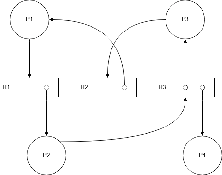

# AACS2284 OCT 2023 Answers

[Link to the paper](https://eprints.tarc.edu.my/26842/2/AACS2284.pdf)

- [Question 1](#question-1)
- [Question 2](#question-2)
- [Question 3](#question-3)
- [Question 4](#question-4)

## Answers

### Question 1

a)

i) SRT

```

|-----|-----|-----|-----|-----|
|  A  |  C  |  E  |  D  |  B  |
|-----|-----|-----|-----|-----|
0     5     7     9     12    16

```

| Process     | Arrival Time | CPU Cycle | Finish Time | Turnaround Time | Waiting Time |
| ----------- | ------------ | --------- | ----------- | --------------- | ------------ |
| A           | 0            | 5         | 5           | 5               | 0            |
| B           | 1            | 4         | 16          | 15              | 11           |
| C           | 3            | 2         | 7           | 4               | 2            |
| D           | 5            | 3         | 12          | 7               | 4            |
| E           | 7            | 2         | 9           | 2               | 0            |
| **Average** |              |           |             | `33/5 = 6.6`    | `17/5 = 3.4` |

ii) RR (3ms)

```

|-----|-----|-----|-----|-----|-----|-----|
|  A  |  B  |  C  |  A  |  D  |  B  |  E  |
|-----|-----|-----|-----|-----|-----|-----|
0     3     6     8     10    13    14    16

```

| Process     | Arrival Time | CPU Cycle | Finish Time | Turnaround Time | Waiting Time |
| ----------- | ------------ | --------- | ----------- | --------------- | ------------ |
| A           | 0            | 5         | 10          | 10              | 5            |
| B           | 1            | 4         | 14          | 13              | 9            |
| C           | 3            | 2         | 8           | 5               | 3            |
| D           | 5            | 3         | 13          | 8               | 5            |
| E           | 7            | 2         | 16          | 9               | 7            |
| **Average** |              |           |             | `45/5 = 9`      | `29/5 = 5.8` |

iii) Preemptive Priority (smaller = higher priority)

```

|-----|-----|-----|-----|-----|-----|
|  A  |  B  |  C  |  A  |  E  |  D  |
|-----|-----|-----|-----|-----|-----|
0     1     5     7     11    13    16

```

| Process     | Arrival Time | CPU Cycle | Priority | Finish Time | Turnaround Time | Waiting Time |
| ----------- | ------------ | --------- | -------- | ----------- | --------------- | ------------ |
| A           | 0            | 5         | 3        | 11          | 11              | 6            |
| B           | 1            | 4         | 1        | 5           | 4               | 0            |
| C           | 3            | 2         | 2        | 7           | 4               | 2            |
| D           | 5            | 3         | 5        | 16          | 11              | 8            |
| E           | 7            | 2         | 4        | 13          | 6               | 4            |
| **Average** |              |           |          |             | `36/5 = 7.2`    | `20/5 = 4`   |

b)

| Manager           | Function                                                                                                                                |
| ----------------- | --------------------------------------------------------------------------------------------------------------------------------------- |
| Processor Manager | - Allocate CPU time to processes<br/>- Keep track of process status<br/>- Set up registers and tables                                   |
| Device Manager    | - Allocation of devices<br/>- Starting operation of devices<br/>- Deallocation of devices once completes                                |
| File Manager      | - Keep track of location of files<br/>- Allocate resources and deallocate resources to files<br/>- Keep track of access rights to files |

c) When a new process needs to take over the CPU, the current process is suspended. The CPU registers are saved in the PCB of the current process. The PCB of the new process is loaded into the CPU registers. The CPU is then set to execute the new process.

### Question 2

a)

i) 

ii) No deadlock. P4 can finish and release R3 to P2. P2 can finish and release R1 to P1. P1 can finish and release R2 to P3. P3 can finish. Hence, no deadlock.

b)

| Deadlock Prevention      | Concrete Example                                                     |
| ------------------------ | -------------------------------------------------------------------- |
| Prevent Resource Holding | A process avoid holding partial resources while waiting for others.  |
| Prevent No Preemption    | A process must be able to be preempted when waiting for resources.   |
| Prevent Circular Wait    | Havender's solution forces a strict ordering of resource allocation. |

c) Spooling is a technique where data is temporarily stored in a buffer so they can be processed later. For example, when printing a document, the document is spooled to the printer's buffer before being printed. However, deadlock can occur if the buffer is full but the printer waiting more data to spool before printing. The printer will be waiting forever, while the buffer cannot be emptied for other processes to use.

d)

| Processes | Allocated | Max     | Need    | Available | Safe? |
| --------- | --------- | ------- | ------- | --------- | ----- |
|           | `A B C`   | `A B C` | `A B C` | `A B C`   |       |
| P1        | `1 1 0`   | `6 5 2` | `5 4 2` | `1 2 2`   | No    |
| P2        | `1 0 0`   | `3 4 1` | `2 4 1` |           |       |
| P3        | `4 1 2`   | `7 6 3` | `3 5 1` |           |       |
| P4        | `2 0 1`   | `2 1 1` | `0 1 0` |           |       |
| P5        | `1 2 1`   | `3 1 4` | `2 1 3` |           |       |
| **Total** | `9 4 4`   |         |         |           |       |

Solution: P4 -> P5 -> P2 -> P1 -> P3

| Processes | Allocated | Max     | Need    | Available | Safe? |
| --------- | --------- | ------- | ------- | --------- | ----- |
|           | `A B C`   | `A B C` | `A B C` | `A  B C`  |       |
| P4        | `2 0 1`   | `2 1 1` | `0 1 0` | `1  2 2`  | Yes   |
| P5        | `1 2 1`   | `3 1 4` | `2 1 3` | `3  2 3`  | Yes   |
| P2        | `1 0 0`   | `3 4 1` | `2 4 1` | `4  4 4`  | Yes   |
| P1        | `1 1 0`   | `6 5 2` | `5 4 2` | `5  4 4`  | Yes   |
| P3        | `4 1 2`   | `7 6 3` | `3 5 1` | `6  5 4`  | Yes   |
| **Total** | `9 4 4`   |         |         | `10 6 6`  |       |

### Question 3

a)

i) First-Fit

| Partition | Partition Size | Process | Process Size | Internal Fragmentation |
| --------- | -------------- | ------- | ------------ | ---------------------- |
| A         | 250            | P1      | 190          | 60                     |
| B         | 150            | P3      | 90           | 60                     |
| C         | 400            | P2      | 310          | 70                     |
| D         | 200            | P5      | 160          | 40                     |
| E         | 100            |         |              |                        |

P4 is waiting

ii) Best-Fit

| Partition | Partition Size | Process | Process Size | Internal Fragmentation |
| --------- | -------------- | ------- | ------------ | ---------------------- |
| A         | 250            | P4      | 230          | 20                     |
| B         | 150            |
| C         | 400            | P2      | 310          | 90                     |
| D         | 200            | P1      | 190          | 10                     |
| E         | 100            | P3      | 90           | 10                     |

P5 is waiting

b)

i) FIFO

| 5       | 0       | 2       | 1       | 0   | 4       | 0       | 3       | 4   | 5       | 1       | 2       |
| ------- | ------- | ------- | ------- | --- | ------- | ------- | ------- | --- | ------- | ------- | ------- |
| **_5_** | 5       | 5       | **_1_** | 1   | 1       | 1       | **_3_** | 3   | 3       | 3       | **_2_** |
|         | **_0_** | 0       | 0       | 0   | **_4_** | 4       | 4       | 4   | **_5_** | 5       | 5       |
|         |         | **_2_** | 2       | 2   | 2       | **_0_** | 0       | 0   | 0       | **_1_** | 1       |

Page Faults: 10

ii) LRU

| 5       | 0       | 2       | 1       | 0   | 4       | 0   | 3       | 4   | 5       | 1       | 2       |
| ------- | ------- | ------- | ------- | --- | ------- | --- | ------- | --- | ------- | ------- | ------- |
| **_5_** | 5       | 5       | **_1_** | 1   | 1       | 1   | **_3_** | 3   | 3       | **_1_** | 1       |
|         | **_0_** | 0       | 0       | 0   | 0       | 0   | 0       | 0   | **_5_** | 5       | 5       |
|         |         | **_2_** | 2       | 2   | **_4_** | 4   | 4       | 4   | 4       | 4       | **_2_** |

Page Faults: 9

c)

```
COBEGIN
  T1 = B * C
  T2 = D * E
  T3 = X + Y
COEND

COBEGIN
  T4 = T1 * T2
  T5 = T3 + Z
COEND

T6 = A * T4
H = T6 + T5
```

d)

i)

- $\text{Page Bit} = log_2(32) = 5$
- $\text{Offset Bit} = log_2(2048) = 11$
- $\text{Logical Address Bits} = 5 + 11 = 16$

ii)

- $\text{Frame Bit} = log_2(256) = 8$
- $\text{Offset Bit} = 11$
- $\text{Physical Address Bits} = 8 + 11 = 19$

### Question 4

a)

- Total cylinders = 300
- Current Head = 74
- Previous Head = 61
- Direction = Right
- Queue = 119, 221, 58, 143, 69, 173, 86, 90
- Sorted Queue = 58, 69, 86, 90, 119, 143, 173, 221

i)

|          | 74  | 119 | 221 | 58  | 143 | 69  | 173 | 86  | 90  |
| -------- | --- | --- | --- | --- | --- | --- | --- | --- | --- |
| Movement |     | 45  | 102 | 163 | 85  | 74  | 104 | 87  | 4   |

Total Movement = 45 + 102 + 163 + 85 + 74 + 104 + 87 + 4 = 664

ii) SSTF

|          | 74  | 69  | 58  | 86  | 90  | 119 | 143 | 173 | 221 |
| -------- | --- | --- | --- | --- | --- | --- | --- | --- | --- |
| Movement |     | 5   | 11  | 28  | 4   | 29  | 24  | 30  | 48  |

Total Movement = 5 + 11 + 28 + 4 + 29 + 24 + 30 + 48 = 179

iii) SCAN

|          | 74  | 86  | 90  | 119 | 143 | 173 | 221 | 299 | 69  | 58  |
| -------- | --- | --- | --- | --- | --- | --- | --- | --- | --- | --- |
| Movement |     | 12  | 4   | 29  | 24  | 30  | 48  | 78  | 230 | 11  |

Total Movement = 12 + 4 + 29 + 24 + 30 + 48 + 78 + 230 + 11 = 466

iv) LOOK

|          | 74  | 86  | 90  | 119 | 143 | 173 | 221 | 69  | 58  |
| -------- | --- | --- | --- | --- | --- | --- | --- | --- | --- |
| Movement |     | 12  | 4   | 29  | 24  | 30  | 48  | 52  | 11  |

Total Movement = 12 + 4 + 29 + 24 + 30 + 48 + 52 + 11 = 210

b)

i) Contiguous allocation stores related records in contiguous blocks of memory. Any record can be read once the starting address and the size are known. This is fast but inefficient for large files due to lacking flexibility in space allocation.

ii) Linked allocation stores records in linked lists. Each record contains a pointer to the next record. This is flexible but slow to access specific records since the entire list must be traversed.

c)

- User Authentication and Authorization
- Firewall
- Antivirus Software
