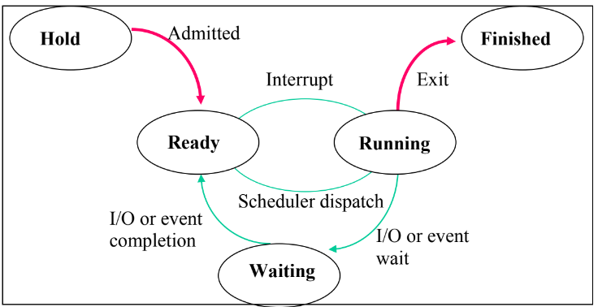
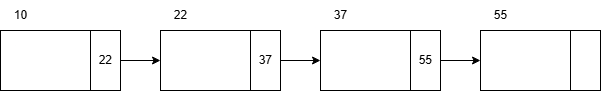

# AACS2284 JUL 2024 Answers

[Link to the paper](https://eprints.tarc.edu.my/29315/1/AACS2284.pdf)

- [Question 1](#question-1)
- [Question 2](#question-2)
- [Question 3](#question-3)
- [Question 4](#question-4)

## Answers

### Question 1

a)

i) SRTF (Preemptive)

```

|-----|-----|-----|-----|-----|-----|
|  A  |  C  |  D  |  B  |  A  |  E  |
|-----|-----|-----|-----|-----|-----|
0     1     3     4     7    10    13

```

| Process     | Arrival Time | CPU Cycle | Finish Time | Turnaround Time | Waiting Time |
| ----------- | ------------ | --------- | ----------- | --------------- | ------------ |
| A           | 0            | 4         | 10          | 10              | 6            |
| B           | 1            | 3         | 7           | 6               | 3            |
| C           | 1            | 2         | 3           | 2               | 0            |
| D           | 3            | 1         | 4           | 1               | 0            |
| E           | 5            | 3         | 13          | 8               | 5            |
| **Average** |              |           |             | `27/5 = 5.4`    | `14/5 = 2.8` |

ii) RR (Time Quantum = 2)

```

|-----|-----|-----|-----|-----|-----|-----|
|  A  |  B  |  C  |  A  |  D  |  B  |  E  |
|-----|-----|-----|-----|-----|-----|-----|
0     2     4     6     8     9    10    13

```

| Process     | Arrival Time | CPU Cycle | Finish Time | Turnaround Time | Waiting Time |
| ----------- | ------------ | --------- | ----------- | --------------- | ------------ |
| A           | 0            | 4         | 8           | 8               | 4            |
| B           | 1            | 3         | 10          | 9               | 6            |
| C           | 1            | 2         | 6           | 5               | 3            |
| D           | 3            | 1         | 9           | 6               | 5            |
| E           | 5            | 3         | 13          | 8               | 5            |
| **Average** |              |           |             | `36/5 = 7.2`    | `23/5 = 4.6` |

iii) Preemptive Priority (Lower number = lower priority // higher number = higher priority)

```

|-----|-----|-----|-----|-----|-----|-----|
|  A  |  C  |  D  |  B  |  E  |  B  |  A  |
|-----|-----|-----|-----|-----|-----|-----|
0     1     3     4     5     8    10    13

```

| Process     | Arrival Time | CPU Cycle | Priority | Finish Time | Turnaround Time | Waiting Time |
| ----------- | ------------ | --------- | -------- | ----------- | --------------- | ------------ |
| A           | 0            | 4         | 1        | 13          | 13              | 9            |
| B           | 1            | 3         | 2        | 10          | 9               | 6            |
| C           | 1            | 2         | 3        | 3           | 2               | 0            |
| D           | 3            | 1         | 5        | 4           | 1               | 0            |
| E           | 5            | 3         | 4        | 8           | 3               | 0            |
| **Average** |              |           |          |             | `28/5 = 5.6`    | `15/5 = 3`   |

b)

i) Thrashing occurs when excessive amount of page swapping back and forth between main memory and secondary storage. This happens during the use of middle level scheduling, which address the issue of overloading the CPU with too many processes. The scheduler will swap out active jobs from memory to reduce the degree of multiprogramming. However, the system throughput will be reduced as more CPU time is spent on swapping jobs in and out of memory.

ii) Thrashing can be minimised by minimising the page fault rate. This can be done by increasing the frame size, which will allow larger pages to be stored in memory and reduce the number of page faults. Another way is to increase the amount of physical memory available to the system, which will allow more pages to be stored in memory and reduce the number of page faults.

c)



Hold - Admitted -> Ready
Ready - Dispatched -> Running
Running - Interrupt -> Ready
Running - Exit -> Finished
Running - I/O Wait -> Waiting
Waiting - I/O Complete -> Ready

### Question 2

a)

i) 

ii) Yes it is deadlock. Process D is waiting for Process B and C to release R1. Process B is waiting for Process A to release R2. Process C is waiting for Process D to release R3. Process A is waiting for both Process B. C and D to release R1 and R3. The circular waiting D -> B -> A -> D and D -> C -> D is a deadlock.

b)

| Processes | Allocated | Max     | Need    | Available | Safe? |
| --------- | --------- | ------- | ------- | --------- | ----- |
|           | `W X Y`   | `W X Y` | `W X Y` | `W X Y`   |       |
| P1        | `0 1 1`   | `3 3 3` | `3 2 2` | `3 3 2`   | Yes   |
| P2        | `1 0 1`   | `4 4 5` | `3 4 4` | `3 4 3`   | No    |
| P3        | `1 1 0`   | `5 5 6` | `4 4 6` |           |       |
| P4        | `1 1 2`   | `4 5 5` | `3 4 3` |           |       |
| Total     | `3 3 4`   |         |         |           |       |

$`
\begin{aligned}
\text{Available} &= \text{Total Resources} - \text{Allocated} \\
&= \begin{bmatrix}
6 & 6 & 6 \\
\end{bmatrix} - 
\begin{bmatrix}
3 & 3 & 4 \\
\end{bmatrix} \\
&= \begin{bmatrix}
3 & 3 & 2 \\
\end{bmatrix}
\end{aligned}
`$

| Processes | Allocated | Max     | Need    | Available | Safe? |
| --------- | --------- | ------- | ------- | --------- | ----- |
|           | `W X Y`   | `W X Y` | `W X Y` | `W X Y`   |       |
| P1        | `0 1 1`   | `3 3 3` | `3 2 2` | `3 3 2`   | Yes   |
| P4        | `1 1 2`   | `4 5 5` | `3 4 3` | `3 4 3`   | Yes   |
| P2        | `1 0 1`   | `4 4 5` | `3 4 4` | `4 5 5`   | Yes   |
| P3        | `1 1 0`   | `5 5 6` | `4 4 6` | `5 5 6`   | Yes   |
| Total     | `3 3 4`   |         |         | `6 6 6`   |       |

Proposed Safe Sequence: P1 -> P4 -> P2 -> P3

c)

i) Resouce holding is a condition where a process is holding one or more resources and waiting for additional resources that are currently being held by other processes. This can lead to deadlock because the process cannot finish its task and release the resources it is holding.

ii) No preemption is a condition where a process cannot be interrupted to release the resources it is holding. This can lead to deadlock because the other processes cannot acquire the resources they need to finish their tasks.

d) Starvation can occur when a process is waiting for a resource that is being held by another process for an extended period of time, causing the waiting process to be indefinitely delayed. For example, if a printer perform the printing task based on priority, a low-priority document may be indefinitely delayed if there are always higher-priority documents being sent to the printer. One way to prevent starvation is to implement aging algoithm, which increases the priority of a waiting process over time. This ensures that a long-waiting process will eventually be able to acquire the resources it needs to finish its task.

### Question 3

a)

i) First Fit

| Partition | Partition Size | Process | Process Size | Internal Fragmentation |
| --------- | -------------- | ------- | ------------ | ---------------------- |
| A         | 20             | 3       | 20           | 0                      |
| B         | 20             |         |              |                        |
| C         | 22             | 1       | 21           | 1                      |
| D         | 25             | 2       | 22           | 3                      |
| E         | 21             |         |              |                        |
| F         | 25             | 4       | 25           | 0                      |

Process 5 cannot be allocated to any partition, need to wait for a partition to be freed.

ii) Best Fit

| Partition | Partition Size | Process | Process Size | Internal Fragmentation |
| --------- | -------------- | ------- | ------------ | ---------------------- |
| A         | 20             | 3       | 20           | 0                      |
| B         | 20             |         |              |                        |
| C         | 22             | 2       | 22           | 0                      |
| D         | 25             | 5       | 22           | 3                      |
| E         | 21             | 1       | 21           | 0                      |
| F         | 25             | 4       | 25           | 0                      |

b)

FIFO

|     | 4       | 2   | 4   | 5       | 1       | 3       | 6       | 4       | 3   | 2       | 3       | 1       | 6       | 5       | 2       |
| --- | ------- | --- | --- | ------- | ------- | ------- | ------- | ------- | --- | ------- | ------- | ------- | ------- | ------- | ------- |
| 3   | **_4_** | 4   | 4   | 4       | 4       | **_3_** | 3       | 3       | 3   | **_2_** | 2       | 2       | **_6_** | 6       | 6       |
| 1   | 1       | 1   | 1   | **_5_** | 5       | 5       | **_6_** | 6       | 6   | 6       | **_3_** | 3       | 3       | **_5_** | 5       |
| 2   | 2       | 2   | 2   | 2       | **_1_** | 1       | 1       | **_4_** | 4   | 4       | 4       | **_1_** | 1       | 1       | **_2_** |

Page Faults: 12

Page Fault Ratio: 12/15 = 0.8

LRU

|     | 4       | 2   | 4   | 5       | 1       | 3       | 6       | 4       | 3   | 2       | 3   | 1       | 6       | 5       | 2       |
| --- | ------- | --- | --- | ------- | ------- | ------- | ------- | ------- | --- | ------- | --- | ------- | ------- | ------- | ------- |
| 3   | **_4_** | 4   | 4   | 4       | 4       | **_3_** | 3       | 3       | 3   | 3       | 3   | 3       | 3       | **_5_** | 5       |
| 1   | 1       | 1   | 1   | **_5_** | 5       | 5       | **_6_** | 6       | 6   | **_2_** | 2   | 2       | **_6_** | 6       | 6       |
| 2   | 2       | 2   | 2   | 2       | **_1_** | 1       | 1       | **_4_** | 4   | 4       | 4   | **_1_** | 1       | 1       | **_2_** |

Page Faults: 11

Page Fault Ratio: 11/15 = 0.7333

c)

```
COBEGIN
  T1 = B + C
  T2 = D / E
  T3 = F * G
COEND

T4 = T2 * T3
A = T1 - T4
```

d)

i)

$`
\begin{aligned}
\text{Offset Bits} &= log_2(4096) \\
&= 12 \text{ bits} \\
\text{Physical Address Bits} &= log_2(8 \times 1024\text{MB} \times 1024\text{KB} \times 1024\text{B}) \\
&= log_2(8589934592) \\
&= 33 \text{ bits} \\
\text{Frame Number Bits} &= \text{Physical Address Bits} - \text{Offset Bits} \\
&= 33 - 12 \\
&= 21 \text{ bits} \\
\end{aligned}
`$

ii)

$`
\begin{aligned}
\text{Page Bits} &= log_2(1024) \\
&= 10 \text{ bits} \\
\text{Offset Bits} &= log_2(4096) \\
&= 12 \text{ bits} \\
\text{Logical Address Bits} &= \text{Page Bits} + \text{Offset Bits} \\
&= 10 + 12 \\
&= 22 \text{ bits} \\
\end{aligned}
`$

### Question 4

a)

Previous Head Position: 65
Current Head Position: 56
Sorted: 23, 28, 50, 60, 71, 78, 85, 90

i) SSTF

|          | 56  | 60  | 50  | 71  | 78  | 85  | 90  | 28  | 23  |
| -------- | --- | --- | --- | --- | --- | --- | --- | --- | --- |
| Movement |     | 4   | 10  | 21  | 7   | 7   | 5   | 62  | 5   |

Total Head Movement: 4 + 10 + 21 + 7 + 7 + 5 + 62 + 5 = 121

ii) LOOK

|          | 56  | 50  | 28  | 23  | 60  | 71  | 78  | 85  | 90  |
| -------- | --- | --- | --- | --- | --- | --- | --- | --- | --- |
| Movement |     | 6   | 22  | 5   | 37  | 11  | 7   | 7   | 5   |

Total Head Movement: 6 + 22 + 5 + 37 + 11 + 7 + 7 + 5 = 100

iii) In LOOK, the disk head only moves as far as the last request in the current direction, instead of going all the way to the end of the disk as in SCAN. This reduces the total head movement, hence improving the seek time to access the requested data.

b)



- The head pointer is used to point to the address of first free memory block, which is 10 in the example. Each block contains the address of the next free memory block. The memory block which starts from 10 points to the next free memory block which is 22. The free blocks are chained together to form the list.

- The advantage of using linked list is it can easily track the number of usable memory blocks.

- The disadvantage is the OS unable to identify contiguous memory blocks, and requires substantial overhead to traverse the linked list to reach the desired free block.

c)

- File manager tracks the location of each files stored.
- File manager determines where and how the files are stored.

d)

i) Sequential Record Organization is a method of storing records in a sequential manner, where each record is stored one after another in a specific order. The files are accessed by searching through the records in order. The search can be improved by sorting the records based on a key field, which allows for faster searching using binary search algorithms.

ii) Direct Access Record Organization stores records in a way that allows for direct access to any record without having to search through the entire file. The records are stored in a specific logical address relative to the file address. The location of each record is determined by hashing the key field of the record. This allows for faster access due to constant time complexity for accessing the records.

iii) Indexed Sequential Record Organization maintains a separate index file which map the key field to the physical location of the record in the data file. It combines the advantages of both sequential and direct access methods. The index file is maintained in sequential order, and the actual data no need to be order, similar as direct access method.
