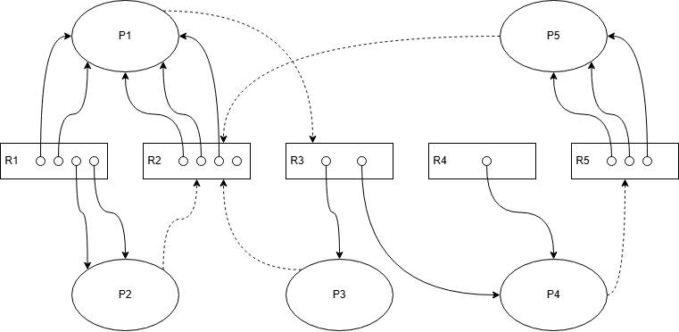

# AACS2284 JUN 2024 Answers

[Link to the paper](https://eprints.tarc.edu.my/28541/1/AACS2284.pdf)

- [Question 1](#question-1)
- [Question 2](#question-2)
- [Question 3](#question-3)
- [Question 4](#question-4)

## Answers

### Question 1

a)

- One factor depended by the scheduling algorithm design is the process burst time.

b) Process Scheduler

> Process scheduler is lower level scheduler, able to recognise which process is I/O bound or CPU bound. It is responsible for scheduling the processes in a way that both CPU and I/O devices are used efficiently.

c)

i) SRTF

```

|-----|-----|-----|-----|-----|-----|-----|
|  A  |  B  |  D  |  E  |  C  |  A  |  F  |
|-----|-----|-----|-----|-----|-----|-----|
20    50    70    90   110   140   170   210

```

| Process     | Arrival Time | CPU Cycle | Finish Time | Turnaround Time | Waiting Time    |
| ----------- | ------------ | --------- | ----------- | --------------- | --------------- |
| A           | 20           | 60        | 170         | 150             | 90              |
| B           | 50           | 20        | 70          | 20              | 0               |
| C           | 50           | 30        | 140         | 90              | 60              |
| D           | 70           | 20        | 90          | 20              | 0               |
| E           | 90           | 20        | 110         | 20              | 0               |
| F           | 100          | 40        | 210         | 110             | 70              |
| **Average** |              |           |             | `410/6 = 68.33` | `220/6 = 36.67` |

ii) SJN

```

|-----|-----|-----|-----|-----|-----|
|  A  |  B  |  D  |  E  |  C  |  F  |
|-----|-----|-----|-----|-----|-----|
20    80   100   120   140   170   210

```

| Process     | Arrival Time | CPU Cycle | Finish Time | Turnaround Time | Waiting Time    |
| ----------- | ------------ | --------- | ----------- | --------------- | --------------- |
| A           | 20           | 60        | 80          | 60              | 0               |
| B           | 50           | 20        | 100         | 50              | 30              |
| C           | 50           | 30        | 170         | 120             | 90              |
| D           | 70           | 20        | 120         | 50              | 30              |
| E           | 90           | 20        | 140         | 50              | 30              |
| F           | 100          | 40        | 210         | 110             | 70              |
| **Average** |              |           |             | `440/6 = 73.33` | `250/6 = 41.67` |

iii) Round Robin (30ms)

```

|-----|-----|-----|-----|-----|-----|-----|
|  A  |  B  |  C  |  A  |  D  |  E  |  F  |
|-----|-----|-----|-----|-----|-----|-----|
20    50    70   100   130   150   170   210

```

| Process     | Arrival Time | CPU Cycle | Finish Time | Turnaround Time | Waiting Time    |
| ----------- | ------------ | --------- | ----------- | --------------- | --------------- |
| A           | 20           | 60        | 130         | 110             | 50              |
| B           | 50           | 20        | 70          | 20              | 0               |
| C           | 50           | 30        | 100         | 50              | 20              |
| D           | 70           | 20        | 150         | 80              | 60              |
| E           | 90           | 20        | 170         | 80              | 60              |
| F           | 100          | 40        | 210         | 110             | 70              |
| **Average** |              |           |             | `450/6 = 75`    | `260/6 = 43.33` |

iv) Preemptive Priority

```

|-----|-----|-----|-----|-----|-----|-----|
|  A  |  C  |  B  |  D  |  A  |  F  |  E  |
|-----|-----|-----|-----|-----|-----|-----|
20    50    80   100   120   150   190   210

```

| Process     | Arrival Time | CPU Cycle | Prority | Finish Time | Turnaround Time | Waiting Time    |
| ----------- | ------------ | --------- | ------- | ----------- | --------------- | --------------- |
| A           | 20           | 60        | 3       | 150         | 130             | 70              |
| B           | 50           | 20        | 2       | 100         | 50              | 30              |
| C           | 50           | 30        | 1       | 80          | 30              | 0               |
| D           | 70           | 20        | 2       | 120         | 50              | 30              |
| E           | 90           | 20        | 4       | 210         | 120             | 100             |
| F           | 100          | 40        | 3       | 190         | 90              | 50              |
| **Average** |              |           |         |             | `470/6 = 78.33` | `280/6 = 46.67` |

d)

- Advantage: It is fair to all processes, hence avoiding starvation.
- Disadvantage: The suitable time quantum is hard to determine. If the time quantum is too small, the overhead of context switching will be high. If the time quantum is too large, the late arrival process will have to wait longer.

### Question 2

a) Example: Process A need to access record 1 and record 2 simultaneously, while process B also need to access record 1 and record 2 simultaneously. However, process A is reading record 1 and process B is writing record 2, causing them to be locked by different processes. Process A will be waiting for process B to finish writing record 2, while process B will be waiting for process A to finish reading record 1. This causes a deadlock.

b) Aging algorithm can be used to prevent starvation. It works by increasing the priority of a process that has been waiting for a long time. This way, the process will eventually get a chance to execute.

c) Difference between deadlock prevention and deadlock avoidance:

| Deadlock Prevention                                                                                       | Deadlock Avoidance                                                        |
| --------------------------------------------------------------------------------------------------------- | ------------------------------------------------------------------------- |
| It prevents deadlock by ensuring that at least one of the necessary conditions for deadlock cannot occur. | It avoids deadlock by ensuring that the system is always in a safe state. |
| It uses techniques such as preemption and mutual exclusion.                                               | It uses techniques such as Dijkstra's Banker's algorithm.                 |

d)

| Processes | Allocated | Max     | Need    | Available | Safe? |
| --------- | --------- | ------- | ------- | --------- | ----- |
|           | `W X Y`   | `W X Y` | `W X Y` | `W X Y`   |       |
| P1        | `5 2 2`   | `6 5 4` | `1 3 2` | `2 3 2`   | Yes   |
| P2        | `1 1 2`   | `6 7 8` | `5 6 6` | `7 5 4`   | No    |
| P3        | `7 2 4`   | `8 3 5` | `1 1 1` |           |       |
| P4        | `6 7 8`   | `7 8 9` | `1 1 1` |           |       |
| P5        | `2 2 1`   | `4 4 5` | `2 2 4` |           |       |
| P6        | `1 1 1`   | `2 2 2` | `1 1 1` |           |       |
| Total     |           |         |         |           |       |

Solution: P1 -> P3 -> P4 -> P6 -> P5 -> P2

| Processes | Allocated | Max     | Need    | Available  | Safe? |
| --------- | --------- | ------- | ------- | ---------- | ----- |
|           | `W X Y`   | `W X Y` | `W X Y` | `W  X  Y`  |       |
| P1        | `5 2 2`   | `6 5 4` | `1 3 2` | `2  3  2`  | Yes   |
| P3        | `7 2 4`   | `8 3 5` | `1 1 1` | `7  5  4`  | Yes   |
| P4        | `6 7 8`   | `7 8 9` | `1 1 1` | `14 7  8`  | Yes   |
| P6        | `1 1 1`   | `2 2 2` | `1 1 1` | `20 14 16` | Yes   |
| P5        | `2 2 1`   | `4 4 5` | `2 2 4` | `21 15 17` | Yes   |
| P2        | `1 1 2`   | `6 7 8` | `5 6 6` | `23 17 18` | Yes   |
| Total     |           |         |         | `24 18 20` |       |

e)

i) 

ii) There is no deadlock. P3 can take the free R2 to finish and free its R3 to P1. P1 can finish and free its R2 to P2 and P5. P2 can finish. P5 can finish to free its R4 to P4. P4 can finish. All processes are able to finish without deadlock.

### Question 3

a)

i) First Fit

| Partition | Partition Size | Process | Process Size | Internal Fragmentation |
| --------- | -------------- | ------- | ------------ | ---------------------- |
| A         | 350            | P3      | 200          | 150                    |
| B         | 480            | P2      | 450          | 30                     |
| C         | 250            | P5      | 200          | 50                     |
| D         | 750            | P1      | 750          | 0                      |
| E         | 280            |
| F         | 120            |

Process P4 is waiting.

ii) Best Fit

| Partition | Partition Size | Process | Process Size | Internal Fragmentation |
| --------- | -------------- | ------- | ------------ | ---------------------- |
| A         | 350            | P4      | 350          | 0                      |
| B         | 480            | P2      | 450          | 30                     |
| C         | 250            | P3      | 200          | 50                     |
| D         | 750            | P1      | 750          | 0                      |
| E         | 280            | P5      | 200          | 80                     |
| F         | 120            |

b)

i) LRU

| 9       | 2       | 8       | 3       | 5       | 6       | 6   | 3   | 5   | 9       | 8   | 3   | 7       | 2       | 8   |
| ------- | ------- | ------- | ------- | ------- | ------- | --- | --- | --- | ------- | --- | --- | ------- | ------- | --- |
| **_9_** | 9       | 9       | 9       | 9       | **_6_** | 6   | 6   | 6   | 6       | 6   | 6   | **_7_** | 7       | 7   |
|         | **_2_** | 2       | 2       | 2       | 2       | 2   | 2   | 2   | **_9_** | 9   | 9   | 9       | 9       | 9   |
|         |         | **_8_** | 8       | 8       | 8       | 8   | 8   | 8   | 8       | 8   | 8   | 8       | 8       | 8   |
|         |         |         | **_3_** | 3       | 3       | 3   | 3   | 3   | 3       | 3   | 3   | 3       | 3       | 3   |
|         |         |         |         | **_5_** | 5       | 5   | 5   | 5   | 5       | 5   | 5   | 5       | **_2_** | 2   |

Page Fault: 9

ii) Optimal

| 9       | 2       | 8       | 3       | 5       | 6       | 6   | 3   | 5   | 9   | 8   | 3   | 7       | 2       | 8   |
| ------- | ------- | ------- | ------- | ------- | ------- | --- | --- | --- | --- | --- | --- | ------- | ------- | --- |
| **_9_** | 9       | 9       | 9       | 9       | 9       | 9   | 9   | 9   | 9   | 9   | 9   | **_7_** | **_2_** | 2   |
|         | **_2_** | 2       | 2       | 2       | **_6_** | 6   | 6   | 6   | 6   | 6   | 6   | 6       | 6       | 6   |
|         |         | **_8_** | 8       | 8       | 8       | 8   | 8   | 8   | 8   | 8   | 8   | 8       | 8       | 8   |
|         |         |         | **_3_** | 3       | 3       | 3   | 3   | 3   | 3   | 3   | 3   | 3       | 3       | 3   |
|         |         |         |         | **_5_** | 5       | 5   | 5   | 5   | 5   | 5   | 5   | 5       | 5       | 5   |

Page Fault: 8

c)

| Fixed Partitioning                                                 | Dynamic Partitioning                                                           |
| ------------------------------------------------------------------ | ------------------------------------------------------------------------------ |
| Each partition size is static                                      | Each partition size is dynamic                                                 |
| Can cause internal fragmentation (Wasted space inside a partition) | Can cause external fragmentation (Wasted space between (outside) 2 partitions) |

d) For example, a text editor program attempts to open a file for editing. The program will perform a wait operation on the semaphore of the file. A semaphore is a variable that determines the eligibility of a process to access a resource. If the semaphore is 1, the process will enter the critical region and access the file, at the same time decrement the semaphore to 0. When there is another process attempts to rename the file outside the editor, it will perform a wait operation on the semaphore. Since the semaphore is 0, the process will be blocked. It can only proceed when the editor process has finished editing the file and performed a signal operation on the semaphore, which will increment the semaphore to 1.

### Question 4

a)

Total Cylinders: 300
Previous Head: 78
Current Head: 62
Current Direction: Left
Queue: 59, 199, 66, 230, 23, 153, 34, 277, 75, 109
Sorted Queue: 23, 34, 59, 66, 75, 109, 153, 199, 230, 277

i) SSTF

|          | 62  | 59  | 66  | 75  | 109 | 153 | 199 | 230 | 277 | 34  | 23  |
| -------- | --- | --- | --- | --- | --- | --- | --- | --- | --- | --- | --- |
| Movement |     | 3   | 7   | 9   | 34  | 44  | 46  | 31  | 47  | 243 | 11  |

Total Movement: 3 + 7 + 9 + 34 + 44 + 46 + 31 + 47 + 243 + 11 = **475**

ii) SCAN

|          | 62  | 59  | 34  | 23  | 0   | 66  | 75  | 109 | 153 | 199 | 230 | 277 |
| -------- | --- | --- | --- | --- | --- | --- | --- | --- | --- | --- | --- | --- |
| Movement |     | 3   | 25  | 11  | 23  | 66  | 9   | 34  | 44  | 46  | 31  | 47  |

Total Movement: 3 + 25 + 11 + 23 + 66 + 9 + 34 + 44 + 46 + 31 + 47 = **339**

iii) LOOK

|          | 62  | 59  | 34  | 23  | 66  | 75  | 109 | 153 | 199 | 230 | 277 |
| -------- | --- | --- | --- | --- | --- | --- | --- | --- | --- | --- | --- |
| Movement |     | 3   | 25  | 11  | 43  | 9   | 34  | 44  | 46  | 31  | 47  |

Total Movement: 3 + 25 + 11 + 43 + 9 + 34 + 44 + 46 + 31 + 47 = **293**

b) Factors that contribute to the performance of a file system:

- How the system files are organized in the disk. Method such as sequential takes longer time to access the files compared to direct access due to the need to read the files in order.
- How the system files are stored in the disk. Method such as linked allocation takes longer time to access the files compared to contiguous allocation due to files are scattered in different locations in the disk.
- How the system files are structured. Fixed length records can be faster to access compared to variable length records because the address of the record in known index can be calculated easily.

c) Contiguous allocation is the best method for this scenario. This is because the large video files are stored in a single location in the disk, hence it is faster to access the files. It also allows effective sequential access to the files for editing, as the files are stored in order.

d) The advantage of contiguous allocation is the file are stored in a single location in order in the disk, which suitable for large files. However, the disadvantage is that it can cause external fragmentation, due to addition and deletion of files. This can cause the disk to have free space that is not large enough to store a new file, even though the total free space is sufficient.
