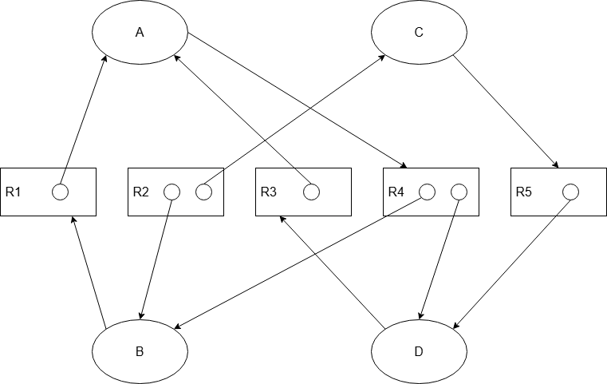

# AACS2284 OCT 2024 Answers

[Link to the paper](https://eprints.tarc.edu.my/30256/1/QP-AACS2284.pdf)

- [Question 1](#question-1)
- [Question 2](#question-2)
- [Question 3](#question-3)
- [Question 4](#question-4)

## Answers

### Question 1

a)

- Active Multiprogramming is a time-sharing system allows each program to use a preset slice of CPU time. When the time slice expires, the job is interrupted and another job is given the CPU time. Example: A web browser which downloads a file and playing videos in different tabs are given CPU time in a round-robin fashion to allow them to run concurrently.
  > Basically round-robin scheduling.
- Passive Multiprogramming allows each program to be serviced in turn. The other jobs need to wait until the current job is completed before they can be serviced.
  > Basically first-come-first-serve scheduling, or any non-preemptive scheduling. Example: A printing system requires the other documents to wait until the current document is printed before the next document can be printed.

b)

- If the time quantum of a round-robin scheduling algorithm is too small, context switching will increase, which will spend more CPU time on the overhead of switching and reduces throughput.
- If the time quantum of a round-robin scheduling algorithm is too large, the waiting time of the jobs will increase, which will reduce the responsiveness of the system.
- The right amount of time quantum is the one that balances the CPU throughput and the waiting time of the jobs.

c)

i) SRTF (Preemptive)

```

|-----|-----|-----|-----|-----|-----|-----|
|  A  |  C  |  D  |  E  |  B  |  F  |  A  |
|-----|-----|-----|-----|-----|-----|-----|
0     3     5     8     9    13    17    22

```

| Process     | Arrival Time | CPU Cycle | Finish Time | Turnaround Time | Waiting Time |
| ----------- | ------------ | --------- | ----------- | --------------- | ------------ |
| A           | 0            | 8         | 22          | 22              | 14           |
| B           | 3            | 4         | 13          | 10              | 6            |
| C           | 3            | 2         | 5           | 2               | 0            |
| D           | 5            | 3         | 8           | 3               | 0            |
| E           | 7            | 1         | 9           | 2               | 1            |
| F           | 7            | 4         | 17          | 10              | 6            |
| **Average** |              |           |             | `49/6 = 8.1667` | `27/6 = 4.5` |

ii) SJN (Non-Preemptive)

```

|-----|-----|-----|-----|-----|-----|
|  A  |  E  |  C  |  D  |  B  |  F  |
|-----|-----|-----|-----|-----|-----|
0     8     9    11    14    18    22

```

| Process     | Arrival Time | CPU Cycle | Finish Time | Turnaround Time | Waiting Time    |
| ----------- | ------------ | --------- | ----------- | --------------- | --------------- |
| A           | 0            | 8         | 8           | 8               | 0               |
| B           | 3            | 4         | 18          | 15              | 11              |
| C           | 3            | 2         | 11          | 8               | 6               |
| D           | 5            | 3         | 14          | 9               | 6               |
| E           | 7            | 1         | 9           | 2               | 1               |
| F           | 7            | 4         | 22          | 15              | 11              |
| **Average** |              |           |             | `57/6 = 9.5`    | `35/6 = 5.8333` |

iii) Round Robin (3ms)

```

|-----|-----|-----|-----|-----|-----|-----|-----|-----|-----|
|  A  |  B  |  C  |  A  |  D  |  B  |  E  |  F  |  A  |  F  |
|-----|-----|-----|-----|-----|-----|-----|-----|-----|-----|
0     3     6     8    11    14    15    16    19    21    22

```

| Process     | Arrival Time | CPU Cycle | Finish Time | Turnaround Time  | Waiting Time    |
| ----------- | ------------ | --------- | ----------- | ---------------- | --------------- |
| A           | 0            | 8         | 21          | 21               | 13              |
| B           | 3            | 4         | 15          | 12               | 8               |
| C           | 3            | 2         | 8           | 5                | 3               |
| D           | 5            | 3         | 14          | 9                | 6               |
| E           | 7            | 1         | 16          | 9                | 8               |
| F           | 7            | 4         | 22          | 15               | 11              |
| **Average** |              |           |             | `71/6 = 11.8333` | `49/6 = 8.1667` |

iv) Preemptive Priority

```

|-----|-----|-----|-----|-----|-----|-----|
|  A  |  B  |  F  |  D  |  C  |  A  |  E  |
|-----|-----|-----|-----|-----|-----|-----|
0     3     7    11    14    16    21    22

```

| Process     | Arrival Time | CPU Cycle | Finish Time | Turnaround Time | Waiting Time    |
| ----------- | ------------ | --------- | ----------- | --------------- | --------------- |
| A           | 0            | 8         | 21          | 21              | 13              |
| B           | 3            | 4         | 7           | 4               | 0               |
| C           | 3            | 2         | 16          | 13              | 11              |
| D           | 5            | 3         | 14          | 9               | 6               |
| E           | 7            | 1         | 22          | 15              | 14              |
| F           | 7            | 4         | 11          | 4               | 0               |
| **Average** |              |           |             | `66/6 = 11`     | `44/6 = 7.3333` |

### Question 2

a)

- Deadlock prevention is the approach to prevent any of the four conditions for deadlock from occurring, which are mutual exclusion, resource holding, no preemption, and circular wait.
- Deadlock avoidance is the approach to avoid deadlock by knowing the resources required by each process in advance to ensure the system will not enter an unsafe state through algorithms like Dijkstra's Banker's algorithm.
- Deadlock detection and recovery is the approach to detect deadlock by reducing the directed resource graph to check for deadlock and perform recovery by algorithms like process termination or resource preemption.

b)

- A real world example of starvation is a printer queue where a high-priority document is indefinitely admitted to the queue, causing low-priority documents to wait indefinitely.
- Aging algorithm is a technique which gradually increases a job's priority corresponding to the time it has spent waiting in the queue, which prevents starvation by ensuring that low-priority jobs will eventually be serviced.

c)

| Processes | Allocated | Max     | Need    | Available | Safe? |
| --------- | --------- | ------- | ------- | --------- | ----- |
|           | `A B C`   | `A B C` | `A B C` | `A B C`   |       |
| P1        | `0 0 2`   | `1 0 4` | `1 0 2` | `3 3 3`   | Yes   |
| P2        | `6 1 6`   | `6 6 6` | `0 5 0` | `3 3 5`   | No    |
| P3        | `2 4 0`   | `5 5 0` | `3 1 0` |           |       |
| P4        | `2 1 0`   | `2 2 2` | `0 1 2` |           |       |

- Solution : P1 -> P4 -> P3 -> P2

| Processes | Allocated | Max     | Need           | Available | Safe? |
| --------- | --------- | ------- | -------------- | --------- | ----- |
|           | `A B C`   | `A B C` | `A B C`        | `A B C`   |       |
| P1        | `0 0 2`   | `1 0 4` | `1 0 2`        | `3 3 3`   | Yes   |
| P4        | `2 1 0`   | `2 2 2` | `0 1 2`        | `3 3 5`   | Yes   |
| P3        | `2 4 0`   | `5 5 0` | `3 1 0`        | `5 4 5`   | Yes   |
| P2        | `6 1 6`   | `6 6 6` | `0 5 0`        | `7 8 5`   | Yes   |
|           |           |         | Total Resource | `13 9 11` |       |

d)

i) 

ii) Yes, the system is in a deadlock state because there is a cycle in the directed resource graph, which is A waiting for B and D, but B and D both waiting for A.

### Question 3

a)

i) LRU

| 1       | 3       | 2       | 4       | 6       | 5       | 7       | 8       | 5   | 8   | 4       | 4   | 6       | 2       | 2   |
| ------- | ------- | ------- | ------- | ------- | ------- | ------- | ------- | --- | --- | ------- | --- | ------- | ------- | --- |
| **_1_** | 1       | 1       | **_4_** | 4       | 4       | **_7_** | 7       | 7   | 7   | **_4_** | 4   | 4       | 4       | 4   |
|         | **_3_** | 3       | 3       | **_6_** | 6       | 6       | **_8_** | 8   | 8   | 8       | 8   | 8       | **_2_** | 2   |
|         |         | **_2_** | 2       | 2       | **_5_** | 5       | 5       | 5   | 5   | 5       | 5   | **_6_** | 6       | 6   |

Number of Page Faults: 11

ii) Optimal Page Replacement

| 1       | 3       | 2       | 4       | 6       | 5       | 7       | 8       | 5   | 8   | 4   | 4   | 6       | 2       | 2   |
| ------- | ------- | ------- | ------- | ------- | ------- | ------- | ------- | --- | --- | --- | --- | ------- | ------- | --- |
| **_1_** | 1       | 1       | **_4_** | 4       | 4       | 4       | 4       | 4   | 4   | 4   | 4   | **_6_** | 6       | 6   |
|         | **_3_** | 3       | 3       | **_6_** | 6       | **_7_** | **_8_** | 8   | 8   | 8   | 8   | 8       | **_2_** | 2   |
|         |         | **_2_** | 2       | 2       | **_5_** | 5       | 5       | 5   | 5   | 5   | 5   | 5       | 5       | 5   |

Number of Page Faults: 10

b)

i) First Fit

| Partition | Partition Size | Process | Process Size | Internal Fragmentation |
| --------- | -------------- | ------- | ------------ | ---------------------- |
| A         | 275            |         |              |                        |
| B         | 650            | P1      | 280          | 370                    |
| C         | 585            | P3      | 500          | 85                     |
| D         | 780            | P2      | 780          | 0                      |
| E         | 300            |         |              |                        |
| F         | 360            | P5      | 350          | 10                     |

Process P4 needs to wait for a partition to be freed.

ii) Best Fit

| Partition | Partition Size | Process | Process Size | Internal Fragmentation |
| --------- | -------------- | ------- | ------------ | ---------------------- |
| A         | 275            |         |              |                        |
| B         | 650            | P4      | 600          | 50                     |
| C         | 585            | P3      | 500          | 85                     |
| D         | 780            | P2      | 780          | 0                      |
| E         | 300            | P1      | 280          | 20                     |
| F         | 360            | P5      | 350          | 10                     |

c)

i)

- Page bit = `log2(256) = 8 bits`
- Offset bit = `log2(4096) = 12 bits`
- Answer: Total bits of Logical Address = `8 + 12 = 20 bits`

> Logical Address = Page Number (p) + Offset (d)

ii)

- 2 GB = `2 * 1024 MB * 1024 KB * 1024 B = 2147483648 B`
- Answer 1: Total bits of Physical Address = `log2(2147483648) = 31 bits`
- Total bits of frame number = `31 - 12 = 19 bits`
- Answer 2: Frame Number = `2^19 = 524288`

> Physical Address = Frame Number (f) + Offset (d)

d)

- Using airline reservation system as an example, the system can allow **multiple users to read the available seats concurrently**, but only **one user can book a seat at a time**.
- This can be achieved by using a **mutex** initialised to 1, and a **semaphore** called `reader_count` initialised to maximum number of readers.
- When a user wants to **read the available seats**, the **first reader will perform a wait operation on the mutex** and **wait operation on the** `reader_count`. The subsequent readers will **only perform a wait operation on the** `reader_count` to read the available seats. After reading, each reader will perform a **signal operation on the** `reader_count` to release the semaphore. The last reader will also perform a **signal operation on the mutex** to release the mutex.
- When a user wants to **book a seat**, the user will perform a **wait operation on the mutex to acquire the mutex**. Then it will perform a **signal operation on the mutex** to release the mutex after booking the seat.
- This way, the system can allow multiple users to read the available seats concurrently, but only one user can book a seat at a time, and readers and writers happen in a mutually exclusive manner.

### Question 4

a)

- Previous Head: `178`
- Current Head: `332`
- Sorted Queue: `37 46 142 188 225 277 320 399 475 543 620 830`

> Exam best if draw the diagram to show the movement of the head, and label each move's distance.

i) SSTF

|          | 332 | 320 | 277 | 225 | 188 | 142 | 46  | 37  | 399 | 475 | 543 | 620 | 830 |
| -------- | --- | --- | --- | --- | --- | --- | --- | --- | --- | --- | --- | --- | --- |
| Movement |     | 12  | 43  | 52  | 37  | 46  | 96  | 9   | 362 | 76  | 68  | 77  | 210 |

Total Head Movement: `12 + 43 + 52 + 37 + 46 + 96 + 9 + 362 + 76 + 68 + 77 + 210 = 1088`

ii) SCAN

|          | 332 | 399 | 475 | 543 | 620 | 830 | 999 | 320 | 277 | 225 | 188 | 142 | 46  | 37  |
| -------- | --- | --- | --- | --- | --- | --- | --- | --- | --- | --- | --- | --- | --- | --- |
| Movement |     | 67  | 76  | 68  | 77  | 210 | 169 | 679 | 43  | 52  | 37  | 46  | 96  | 9   |

Total Head Movement: `67 + 76 + 68 + 77 + 210 + 169 + 679 + 43 + 52 + 37 + 46 + 96 + 9 = 1629`

iii) LOOK

|          | 332 | 399 | 475 | 543 | 620 | 830 | 320 | 277 | 225 | 188 | 142 | 46  | 37  |
| -------- | --- | --- | --- | --- | --- | --- | --- | --- | --- | --- | --- | --- | --- |
| Movement |     | 67  | 76  | 68  | 77  | 210 | 169 | 43  | 52  | 37  | 46  | 96  | 9   |

Total Head Movement: `67 + 76 + 68 + 77 + 210 + 510 + 43 + 52 + 37 + 46 + 96 + 9 = 1291`

b)

| Polling                                                                                                                                               | Interrupt                                                                                                                                 |
| ----------------------------------------------------------------------------------------------------------------------------------------------------- | ----------------------------------------------------------------------------------------------------------------------------------------- |
| Polling is a technique where the CPU repeatedly checks the status of channel status bit to verify if the I/O device is ready to send or receive data. | Interrupt is a technique where the I/O device sends an interrupt signal to the CPU to notify it that it is ready to send or receive data. |
| Disadvantage due to CPU time wasted on checking the status of the device                                                                              | Advantage as CPU can immediately respond to the I/O device need while performing other tasks.                                             |

c)

- Sequential record organization is **NOT** suitable for John's store because it requires the records to be stored in a specific order, which can make it difficult to update or delete records. This can lead to fragmentation and inefficient use of storage space.
- Additionally, if John needs to search for a specific product or update its stock level, he would have to read through the entire file sequentially, which can be time-consuming and inefficient.

d)

- A free-space management technique that John can use is **counting free space**. This technique involves maintaining a list of free blocks' addresses and their sizes. When a new record is added, the system can quickly find a suitable block of free space to store the record.
- This technique is suitable for John's store because it allows for efficient allocation and deallocation of free space, reducing fragmentation and improving storage utilization. Additionally, it allows for quick access to free space, making it easier to add or update records without having to read through the entire file sequentially.
